# Focus Flow - Premium Pomodoro Timer

```mermaid
graph TD
    A[🚀 Start Application] --> B[⚙️ Configure Settings]
    B --> C[🎯 Select Work Session]
    C --> D[▶️ Start Timer]
    D --> E{Timer Running?}
    E -->|Yes| F[⏰ Count Down]
    F --> G{Time Up?}
    G -->|No| F
    G -->|Yes| H[🔔 Notification]
    H --> I[📊 Update Stats]
    I --> J{Session Type?}
    J -->|Work| K{Long Break Due?}
    K -->|Yes| L[🌟 Long Break]
    K -->|No| M[☕ Short Break]
    J -->|Break| N[🎯 Back to Work]
    L --> O[Auto-start?]
    M --> O
    N --> O
    O -->|Yes| D
    O -->|No| P[⏸️ Wait for User]
    P --> D
    E -->|No| Q[⏸️ Paused State]
    Q --> R[User Action?]
    R -->|Resume| D
    R -->|Reset| C
    R -->|Skip| H
    
    style A fill:#667eea,stroke:#333,stroke-width:2px,color:#fff
    style H fill:#ff6b6b,stroke:#333,stroke-width:2px,color:#fff
    style I fill:#51cf66,stroke:#333,stroke-width:2px,color:#fff
```



## 🌟 Overview

**Focus Flow** is a premium Pomodoro timer application designed to maximize productivity through scientifically-proven time management techniques. Built with modern React and featuring a stunning glassmorphism design, it combines functionality with aesthetic excellence.

## 🚀 Live Demo

**🔗 Deployment Link:** `[Add your deployment URL here]`

---

## ✨ Key Features

### 🎯 **Smart Session Management**
- **Automatic Progression**: Seamlessly transitions between work and break sessions
- **Customizable Durations**: Adjust work (1-120 min), short break (1-30 min), and long break (1-60 min)
- **Intelligent Long Breaks**: Automatically schedules longer breaks after configurable work sessions
- **Auto-start Options**: Choose whether breaks and work sessions start automatically

### 📊 **Advanced Analytics & Tracking**
- **Session Statistics**: Track completed sessions, total focus time, and averages
- **Streak System**: Build momentum with consecutive session streaks
- **Achievement Levels**: Progress from Beginner → Pro → Expert → Master
- **Daily Progress**: Monitor today's productivity with session counters
- **Productivity Insights**: AI-powered suggestions based on your patterns

### 🎨 **Premium User Experience**
- **Glassmorphism Design**: Modern, translucent interface with blur effects
- **Animated Backgrounds**: Dynamic gradient animations and floating patterns
- **Micro-interactions**: Smooth hover effects, button animations, and transitions
- **Responsive Layout**: Optimized for desktop, tablet, and mobile devices
- **Professional Typography**: Inter and JetBrains Mono font combination

### ⚡ **Advanced Functionality**
- **Browser Notifications**: Desktop alerts for session completions
- **Dynamic Favicon**: Visual indicator of current session type
- **Audio Notifications**: Professional sound design for different events
- **Keyboard Shortcuts**: Power-user controls for efficient operation
- **Local Storage**: Persistent settings and statistics across sessions
- **Multi-tab Sync**: Settings synchronize across browser tabs

---

## 🎮 User Interface

### Session Types
| Type | Icon | Default Duration | Purpose |
|------|------|------------------|---------|
| **Focus** | 🎯 | 25 minutes | Deep work sessions |
| **Short Break** | ☕ | 5 minutes | Quick mental reset |
| **Long Break** | 🌟 | 15 minutes | Extended recovery |

### Visual Indicators
- **Progress Ring**: Animated circular progress with session-specific colors
- **Focus Mode Badge**: Appears during active work sessions
- **Streak Fire**: 🔥 Displays current productivity streak
- **Urgency Effects**: Visual changes in final 10% of session

---

## ⌨️ Keyboard Shortcuts

| Key | Action | Description |
|-----|--------|-------------|
| `Space` | Start/Pause | Toggle timer state |
| `R` | Reset | Reset current session |
| `S` | Skip | Skip to next session |
| `1` | Work Session | Switch to focus mode |
| `2` | Short Break | Switch to short break |
| `3` | Long Break | Switch to long break |

---

## 🛠️ Technical Architecture

### Built With
- **React 18** - Modern React with hooks and functional components
- **Vite** - Lightning-fast build tool and development server
- **Web Audio API** - Professional audio notifications
- **Notification API** - Browser desktop notifications
- **Local Storage API** - Persistent data storage

### Project Structure
```
src/
├── components/           # React components
│   ├── Timer.jsx        # Main timer display with progress ring
│   ├── Controls.jsx     # Play/pause/reset/skip controls
│   ├── SessionTabs.jsx  # Session type selector
│   ├── Stats.jsx        # Statistics dashboard
│   ├── Settings.jsx     # Configuration panel
│   └── ProductivityInsights.jsx # AI insights
├── hooks/               # Custom React hooks
│   ├── useAudio.jsx     # Audio notification system
│   ├── useLocalStorage.jsx # Persistent storage
│   └── useNotifications.jsx # Browser notifications
├── App.jsx              # Main application component
├── App.css              # Component-specific styles
├── index.css            # Global styles and design system
└── main.jsx             # Application entry point
```

### Design System
- **Color Palette**: Gradient-based with work/break specific themes
- **Spacing**: 8px grid system (4px, 8px, 16px, 24px, 32px, 48px, 64px)
- **Typography**: Inter (UI) + JetBrains Mono (timer display)
- **Border Radius**: Consistent scale (8px, 16px, 24px, 32px, full)
- **Animations**: Cubic-bezier easing with spring effects

---

## 🚀 Getting Started

### Prerequisites
- Node.js 16+ 
- npm or yarn package manager

### Installation

1. **Clone the repository**
   ```bash
   git clone [repository-url]
   cd focus-flow-pomodoro
   ```

2. **Install dependencies**
   ```bash
   npm install
   ```

3. **Start development server**
   ```bash
   npm run dev
   ```

4. **Build for production**
   ```bash
   npm run build
   ```

5. **Preview production build**
   ```bash
   npm run preview
   ```

---

## 📱 Usage Guide

### First Time Setup
1. **Configure Settings**: Adjust session durations to your preference
2. **Enable Notifications**: Allow browser notifications for session alerts
3. **Set Audio Preferences**: Choose whether to enable completion sounds

### Daily Workflow
1. **Start Focus Session**: Click "Start Focus" or press `Space`
2. **Work Distraction-Free**: Focus on your task until the timer completes
3. **Take Breaks**: Follow the automatic break suggestions
4. **Track Progress**: Monitor your statistics and streaks
5. **Adjust as Needed**: Modify settings based on your productivity patterns

### Pro Tips
- **Use Keyboard Shortcuts**: Become more efficient with hotkeys
- **Build Streaks**: Consecutive sessions unlock achievement levels
- **Monitor Insights**: Check productivity suggestions regularly
- **Customize Durations**: Experiment with different session lengths

---

## 🎯 Productivity Features

### Pomodoro Technique Implementation
- **25-minute work sessions** (customizable)
- **5-minute short breaks** after each work session
- **15-30 minute long breaks** after every 4 work sessions
- **Automatic session progression** with optional auto-start

### Analytics Dashboard
- **Session Counter**: Total completed focus sessions
- **Focus Time**: Cumulative time spent in deep work
- **Current Streak**: Consecutive sessions without breaking the chain
- **Daily Progress**: Today's session count and progress
- **Average Session**: Mean duration of completed sessions
- **Focus Hours**: Total productive hours achieved

### Achievement System
| Level | Streak Required | Badge | Benefits |
|-------|----------------|-------|----------|
| Beginner | 0-2 sessions | 🌱 | Getting started |
| Pro | 3-4 sessions | ⭐ | Building momentum |
| Expert | 5-9 sessions | 💎 | Strong focus habits |
| Master | 10+ sessions | 🏆 | Peak productivity |

---

## 🔧 Configuration Options

### Timer Settings
- **Work Duration**: 1-120 minutes (default: 25)
- **Short Break**: 1-30 minutes (default: 5)
- **Long Break**: 1-60 minutes (default: 15)
- **Long Break Interval**: 2-10 sessions (default: 4)

### Automation Settings
- **Auto-start Breaks**: Automatically begin break sessions
- **Auto-start Work**: Automatically begin work sessions
- **Sound Notifications**: Enable/disable audio alerts

### Notification Types
- **Session Complete**: Work session finished
- **Break Over**: Break time ended
- **Achievement Unlocked**: New streak level reached

---

## 🎨 Design Philosophy

### Visual Design Principles
- **Minimalism**: Clean, distraction-free interface
- **Hierarchy**: Clear information architecture
- **Consistency**: Unified design language throughout
- **Accessibility**: High contrast ratios and keyboard navigation

### User Experience Goals
- **Effortless Operation**: Intuitive controls and workflows
- **Visual Feedback**: Clear indication of current state
- **Motivation**: Gamification through streaks and achievements
- **Customization**: Adaptable to individual preferences

---

## 🌐 Browser Compatibility

| Browser | Version | Support Level |
|---------|---------|---------------|
| Chrome | 80+ | ✅ Full Support |
| Firefox | 75+ | ✅ Full Support |
| Safari | 13+ | ✅ Full Support |
| Edge | 80+ | ✅ Full Support |

### Required APIs
- **Web Audio API**: For notification sounds
- **Notification API**: For desktop alerts
- **Local Storage**: For data persistence
- **Intersection Observer**: For animations

---

## 📊 Performance Metrics

- **First Contentful Paint**: < 1.5s
- **Largest Contentful Paint**: < 2.5s
- **Cumulative Layout Shift**: < 0.1
- **First Input Delay**: < 100ms
- **Bundle Size**: < 200KB gzipped

---

## 🤝 Contributing

We welcome contributions! Please follow these guidelines:

1. **Fork the repository**
2. **Create a feature branch**: `git checkout -b feature/amazing-feature`
3. **Commit changes**: `git commit -m 'Add amazing feature'`
4. **Push to branch**: `git push origin feature/amazing-feature`
5. **Open a Pull Request**

### Development Guidelines
- Follow existing code style and conventions
- Add comments for complex logic
- Test thoroughly across different browsers
- Update documentation for new features

---

## 📝 Changelog

### Version 2.0.0 (Current)
- ✨ Complete UI/UX redesign with glassmorphism
- 🎵 Professional audio notification system
- 📊 Advanced analytics and productivity insights
- ⌨️ Comprehensive keyboard shortcuts
- 🔔 Enhanced browser notifications
- 📱 Improved mobile responsiveness

---

## 🐛 Known Issues

- Audio notifications may not work in some mobile browsers
- Notification permissions must be granted manually
- Background timers may pause in inactive tabs (browser limitation)

---

## 🔮 Roadmap

- [ ] **Cloud Sync**: Synchronize data across devices
- [ ] **Team Features**: Collaborative Pomodoro sessions
- [ ] **Advanced Analytics**: Weekly/monthly reports
- [ ] **Themes**: Multiple color schemes and customization
- [ ] **Integrations**: Calendar and task management apps
- [ ] **Mobile App**: Native iOS and Android applications

---

## 📄 License

This project is licensed under the MIT License - see the [LICENSE](LICENSE) file for details.

---

## 👨‍💻 Author

**Created by Saket**

A passionate developer focused on creating beautiful, functional applications that enhance productivity and user experience.

---

## 🙏 Acknowledgments

- **Pomodoro Technique** - Francesco Cirillo for the time management method
- **Design Inspiration** - Modern glassmorphism and neumorphism trends
- **React Community** - For excellent documentation and ecosystem
- **Open Source** - All the amazing libraries that made this possible

---

## 📞 Support

If you encounter any issues or have questions:

1. **Check the documentation** above
2. **Search existing issues** in the repository
3. **Create a new issue** with detailed information
4. **Contact the author** for urgent matters

---

**⭐ If you find this project helpful, please consider giving it a star!**

---

*Focus Flow - Where productivity meets beautiful design* ✨